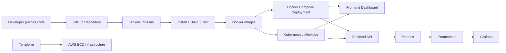

# CloudShield - DevOps CI/CD Monitoring Platform

CloudShield is a production-style academic project for Cloud Computing and DevOps coursework. It demonstrates a complete workflow around Docker, Jenkins, Kubernetes, Prometheus, Grafana, Terraform, CI/CD pipelines, monitoring, and cloud infrastructure.

The application logic is intentionally simple. The main value of the project is the DevOps delivery path: code moves from GitHub to Jenkins, Docker images are built, containers are deployed, Kubernetes manages replicas, Prometheus scrapes backend metrics, Grafana visualizes telemetry, and the React dashboard shows deployment and monitoring status.

## Architecture



## Project Structure

```text
cloudshield/
  frontend/              React + Tailwind dashboard
  backend/               Express API + Prometheus metrics
  kubernetes/            Minikube-compatible manifests
  monitoring/            Prometheus config and Grafana notes
  terraform/             AWS EC2 infrastructure as code
  docs/screenshots/      Placeholder folder for project screenshots
  docker-compose.yml     Local multi-service deployment
  Jenkinsfile            Declarative CI/CD pipeline
  README.md              Project documentation
```

## Local Setup

Requirements:

- Node.js 20 or newer
- Docker and Docker Compose
- Jenkins with Docker access
- Minikube and kubectl
- Terraform

Run locally with Docker Compose:

```bash
cd cloudshield
docker compose up -d --build
```

If a default port is already in use, override it:

```bash
FRONTEND_PORT=3002 docker compose up -d --build
```

PowerShell example:

```powershell
$env:FRONTEND_PORT="3002"; docker compose up -d --build
```

Open:

- Frontend dashboard: `http://localhost:3000`
- Backend health: `http://localhost:5000/api/health`
- Prometheus: `http://localhost:9090`
- Grafana: `http://localhost:3001`

Grafana default login:

- Username: `admin`
- Password: `admin`

Stop the stack:

```bash
docker compose down
```

## Backend APIs

The backend exposes realistic DevOps JSON data:

```text
GET /api/health
GET /api/metrics
GET /api/deployments
GET /api/alerts
GET /metrics
```

Example:

```bash
curl http://localhost:5000/api/metrics
curl http://localhost:5000/metrics
```

## Frontend Dashboard

The React dashboard includes:

- CPU usage
- RAM usage
- Active containers
- Deployment status
- Uptime
- Jenkins build status
- Kubernetes pod status
- Monitoring charts
- Alert list
- System health view

During local development:

```bash
cd frontend
npm install
npm run dev
```

Run the backend separately:

```bash
cd backend
npm install
npm run dev
```

## Jenkins CI/CD

The included `Jenkinsfile` uses a declarative pipeline with these stages:

1. Install dependencies
2. Build frontend
3. Run backend tests
4. Build Docker images
5. Deploy using Docker Compose

Jenkins setup:

1. Create a new Pipeline job.
2. Connect it to your GitHub repository.
3. Enable GitHub webhook triggering.
4. Make sure Jenkins agents can run `docker` and `docker compose`.
5. Use the repository `Jenkinsfile`.

Manual Jenkins-style command sequence:

```bash
cd cloudshield
docker compose down
docker compose up -d --build
```

## Kubernetes / Minikube

Start Minikube:

```bash
minikube start
```

Build images directly inside Minikube:

```bash
eval $(minikube docker-env)
docker build -t cloudshield-backend:latest ./backend
docker build -t cloudshield-frontend:latest ./frontend
```

Apply manifests:

```bash
kubectl apply -f kubernetes/service.yaml
kubectl apply -f kubernetes/deployment.yaml
```

Check resources:

```bash
kubectl get all -n cloudshield
kubectl get pods -n cloudshield
```

Access the frontend through port forwarding:

```bash
kubectl port-forward -n cloudshield service/cloudshield-frontend 8080:80
```

Open `http://localhost:8080`.

Access the backend:

```bash
kubectl port-forward -n cloudshield service/cloudshield-backend 5000:5000
```

## Prometheus

Prometheus is configured in `monitoring/prometheus.yml` to scrape:

```text
cloudshield-backend:5000/metrics
```

When Docker Compose is running, open `http://localhost:9090/targets` and verify that `cloudshield-backend` is up.

Useful queries:

```text
cloudshield_http_requests_total
cloudshield_cpu_usage_percent
cloudshield_active_deployments
cloudshield_nodejs_heap_size_used_bytes
```

## Grafana

1. Open `http://localhost:3001`.
2. Log in with `admin` / `admin`.
3. Add Prometheus as a data source with URL `http://prometheus:9090`.
4. Create panels for request count, CPU usage, active deployments, Node.js memory, and process CPU.
5. Save the dashboard as `CloudShield DevOps Monitoring`.

Additional notes are in `monitoring/grafana-dashboard-notes.md`.

## Terraform AWS EC2

The Terraform configuration creates:

- AWS security group
- EC2 instance
- Ingress rules for SSH, frontend, backend, Prometheus, and Grafana
- Outputs for public IP, frontend URL, and Grafana URL

Usage:

```bash
cd terraform
terraform init
terraform plan \
  -var="ami_id=ami-xxxxxxxxxxxxxxxxx" \
  -var="key_name=your-key-pair"
terraform apply \
  -var="ami_id=ami-xxxxxxxxxxxxxxxxx" \
  -var="key_name=your-key-pair"
```

After provisioning, SSH into the instance, clone your repository, install Docker Compose if needed, and run:

```bash
docker compose up -d --build
```

Destroy resources after the demo:

```bash
terraform destroy \
  -var="ami_id=ami-xxxxxxxxxxxxxxxxx" \
  -var="key_name=your-key-pair"
```

## Screenshot Placeholders

Add screenshots for the academic report in:

```text
docs/screenshots/dashboard.png
docs/screenshots/deployments.png
docs/screenshots/prometheus-targets.png
docs/screenshots/grafana-dashboard.png
docs/screenshots/jenkins-pipeline.png
docs/screenshots/kubernetes-pods.png
```

## Academic Demonstration Flow

1. Push code to GitHub.
2. Jenkins receives webhook and starts the pipeline.
3. Jenkins installs dependencies, builds React, and tests Express.
4. Jenkins builds frontend and backend Docker images.
5. Docker Compose deploys frontend, backend, Prometheus, and Grafana.
6. Kubernetes manifests show how the same images can be orchestrated on Minikube.
7. Prometheus scrapes `/metrics` from the backend.
8. Grafana visualizes Prometheus metrics.
9. CloudShield dashboard displays CI/CD, deployment, alert, and health data.

## License

This project is provided for educational use in Cloud Computing and DevOps coursework.
